## Настройка **gitlab-runner**

##### Поднять виртуальную машину *Ubuntu Server 20.04 LTS*
##### Скачать и установить на виртуальную машину **gitlab-runner**

- Скачиваю и устанавливаю **gitlab-runner** 
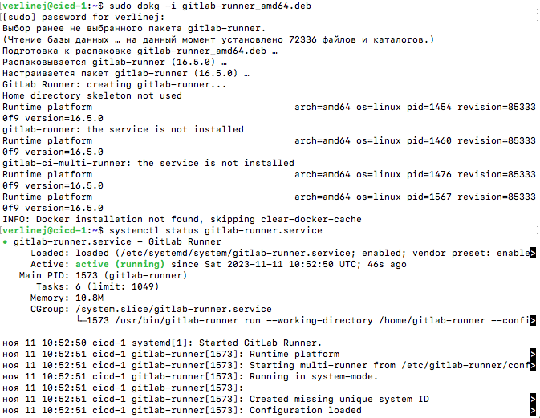

##### Запустить **gitlab-runner** и зарегистрировать его для использования в текущем проекте (*DO6_CICD*)

- gitlab-runner запущен, теперь регистрируюсь командой `sudo gitlab-runner register` 
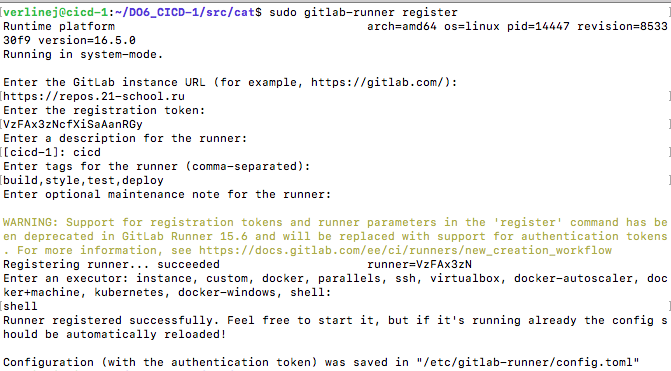

## Сборка

#### Написать этап для **CI** по сборке приложений из проекта *C2_SimpleBashUtils*:
##### В файле _gitlab-ci.yml_ добавить этап запуска сборки через мейк файл из проекта _C2_
##### Файлы, полученные после сборки (артефакты), сохранять в произвольную директорию со сроком хранения 30 дней.

- Переношу написанный **cat** и **grep** из первого проекта, создаю файл **.gitlab-ci.yml** (должен распологаться в корне проекта) добавля стадию сборки через **make**, сохраняю артефакты.
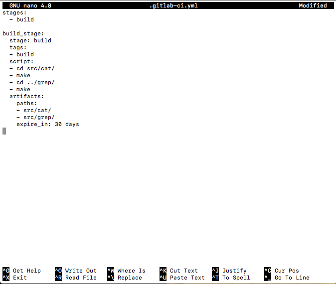

- Если всё сделано верно в файле **.gitlab-ci.yml** нет ошибок то после пуша в гите отобразится успешное выполнение стадии.

## Тест кодстайла

#### Написать этап для **CI**, который запускает скрипт кодстайла (*clang-format*):

- Добавляю в файл **.gitlab-ci.yml** стадию проверки стиля. 
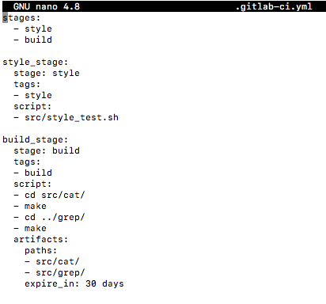
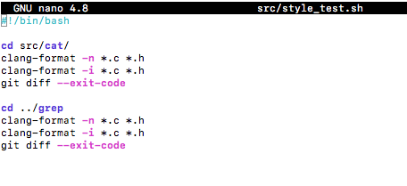

##### Если кодстайл не прошел, то "зафейлить" пайплайн
##### В пайплайне отобразить вывод утилиты *clang-format*

- В случае если проверка на стиль прошла успешно. 
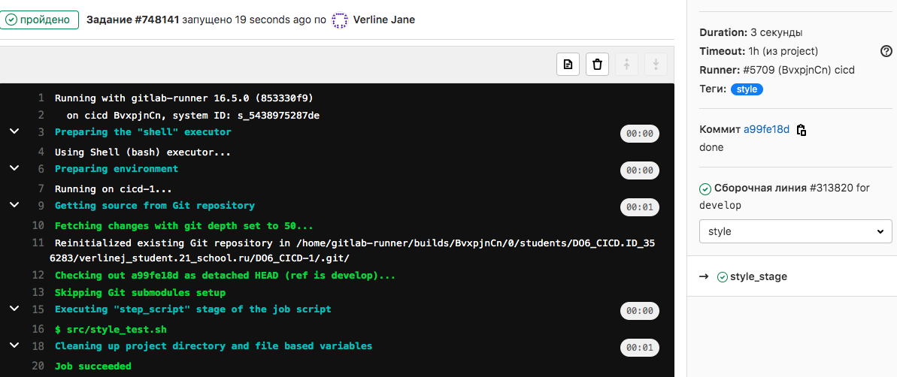

- Случай если кодстайл не прошёл. 
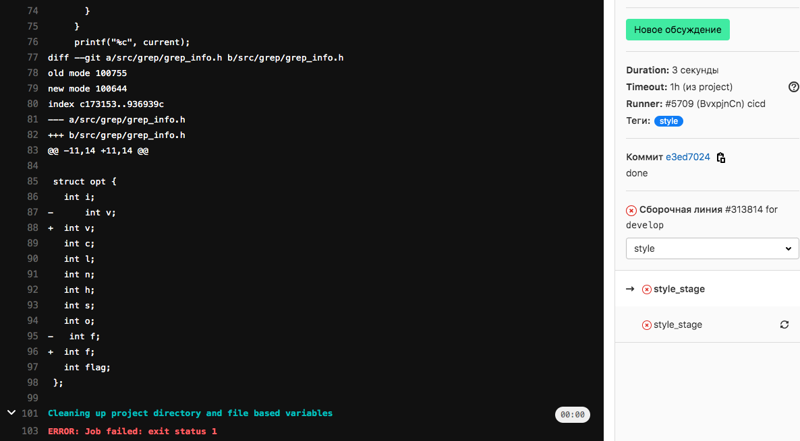

## Интеграционные тесты

#### Написать этап для **CI**, который запускает ваши интеграционные тесты из того же проекта:

- Добавляю стадию тестирования. 
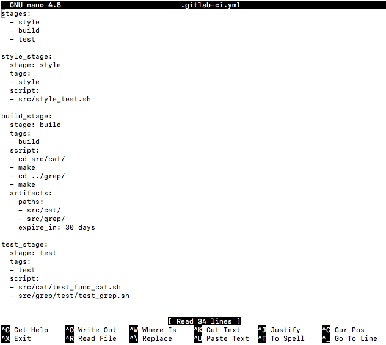

##### Запускать этот этап автоматически только при условии, если сборка и тест кодстайла прошли успешно

##### Если тесты не прошли, то "зафейлить" пайплайн

- Если в тестах есть хоть один FAIL то пайплайн провален. 
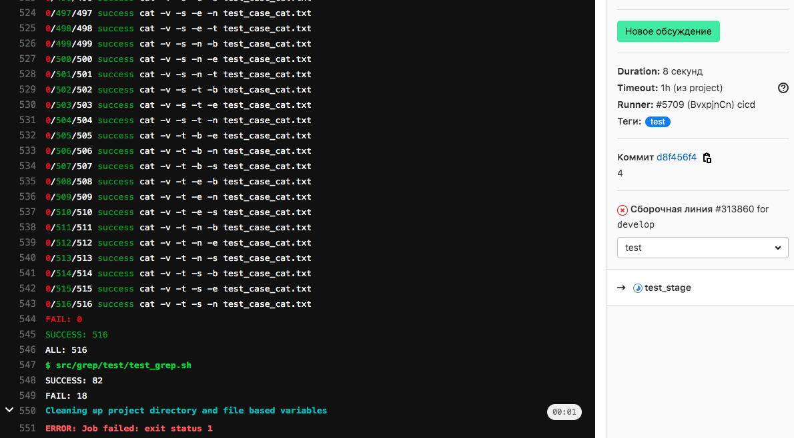

##### В пайплайне отобразить вывод, что интеграционные тесты успешно прошли / провалились

- Если FAIL отсутствуют, пайплайн завершается статусом succes. 
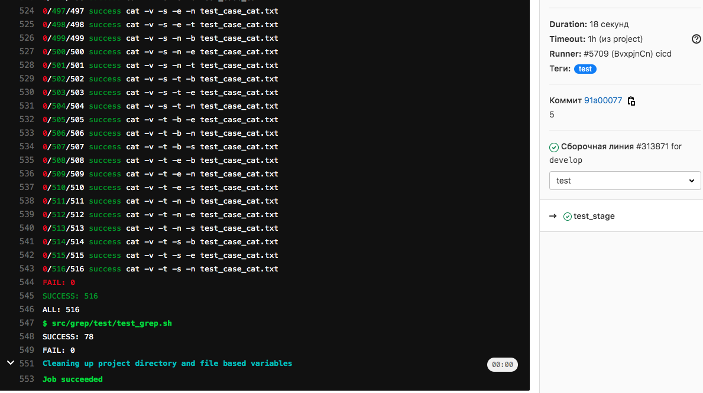

## Этап деплоя

##### Поднять вторую виртуальную машину *Ubuntu Server 20.04 LTS*

- Поднимаю вторую виртуальную машину. 
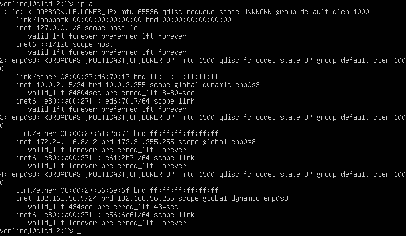

#### Написать этап для **CD**, который "разворачивает" проект на другой виртуальной машине:
##### Запускать этот этап вручную при условии, что все предыдущие этапы прошли успешно
##### Написать bash-скрипт, который при помощи **ssh** и **scp** копирует файлы, полученные после сборки (артефакты), в директорию */usr/local/bin* второй виртуальной машины

- Bash скрипт для деплоя. 
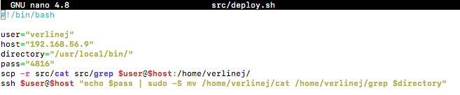

- Для того что бы всё сработало, нужно настроить соединение между машинами, для этого захожу под пользователем **gitlab-runner** `sudo su gitlab-runner`, генерирую ключ `ssh-keygen -t rsa -b 2048` и копирую его на вторую машину `ssh-copy-id verlinej@192.168.56.8`, для того что бы при подключении или копировании не было запроса пароля. 
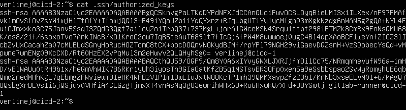

##### В файле _gitlab-ci.yml_ добавить этап запуска написанного скрипта

- Добавляю этам деплоя. 
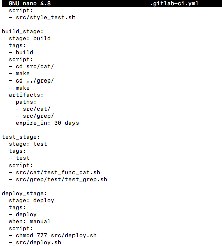

##### В случае ошибки "зафейлить" пайплайн

- Этот этап ожидает ручного запуска, если всё корректно, всё проходит
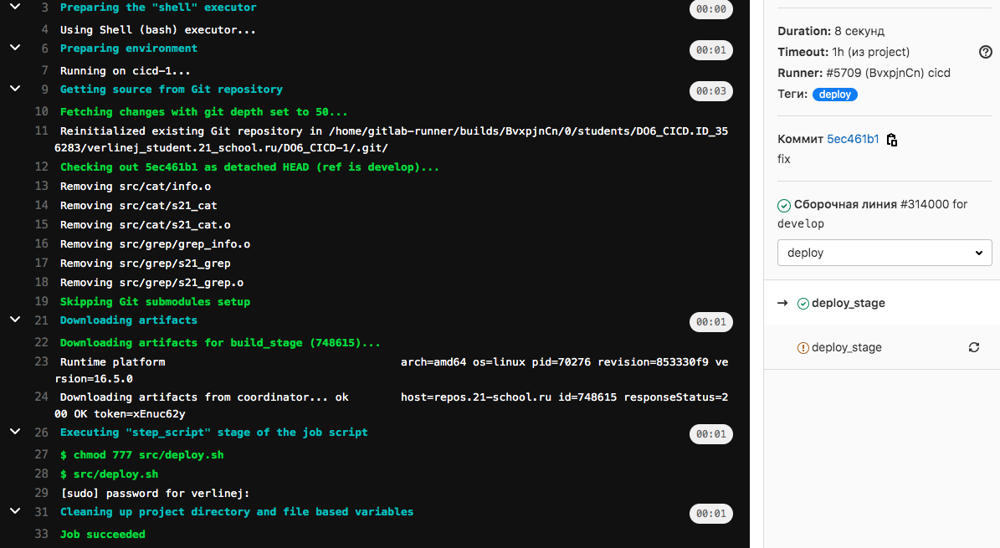
И на второй машине смотрим наличие артефактов.
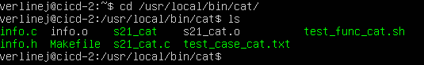

## Уведомления

##### Настроить уведомления о успешном/неуспешном выполнении пайплайна через бота с именем "[ваш nickname] DO6 CI/CD" в *Telegram*

- Создаю телеграм бота с помощью ***@BotFather*** и для того что бы узнать ID_USER воспользовался ***@getmyid_bot***

- Создаю bash скрипт для отправки уведомлени в телеграм 
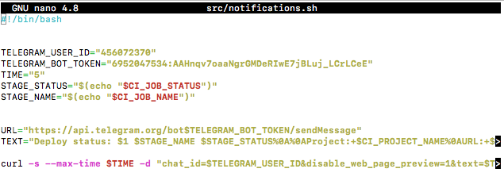

- Добавляю выполнение этого скрипта в ***.gitlab-runner.yml***
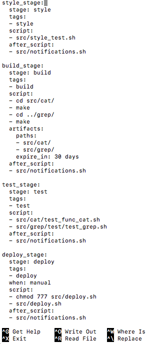

- Результат 
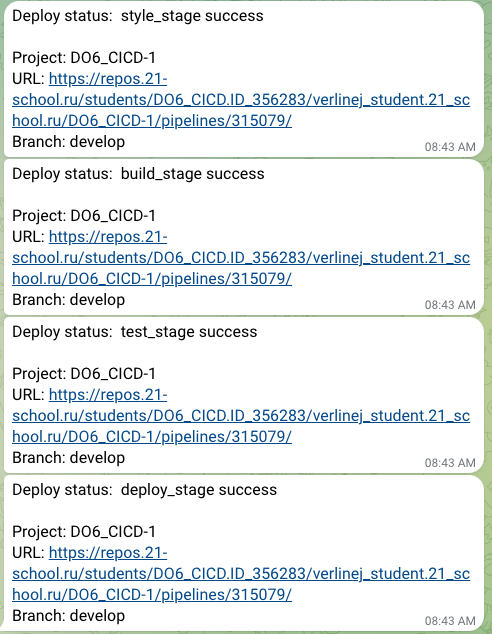
