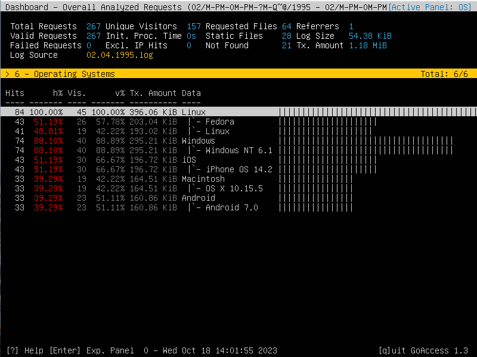

## Использование утилиты Goaccess.

- 1 Количество уникальных пользователей

- 2 Запрашиваемые файлы (URLs)

- 3 Запрошенные статичные файлы

- 4 Не найденые файлы (URLs)

- 5 ip хоста и имя.

- 6 Используемая операционная система

- 7 Используемый браузер

- 8 Распределение времени

- 9 Статус кода
