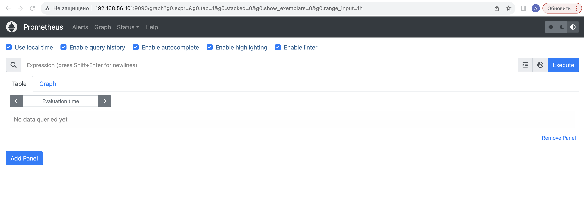

## Установка и настройка Prometheus

- Для установки последней версии Prometheus скачиваем архив вручную. 
`wget https://github.com/prometheus/prometheus/releases/download/v2.48.0-rc.0/prometheus-2.48.0-rc.0.linux-amd64.tar.gz`

- Распаковываю 
`tar -xvzf prometheus-2.48.0-rc.0.linux-amd64.tar.gz prometheus-2.48.0-rc.0.linux-amd64/`

- Копирую исполняемые файлы и копируюю файлы конфигурации. 
`cd prometheus-2.20.1.linux-amd64/` 
`cp prometheus /usr/local/bin/` 
`cp promtool /usr/local/bin/` 
`cp -r consoles/ /etc/prometheus/consoles/` 
`cp -r console_libraries/ /etc/prometheus/console_libraries/` 
`cp prometheus.yml /etc/prometheus/`

- Создайю папку для хранения данных: 
`mkdir /var/lib/prometheus`

- Создайте пользователя и назначьте владельца файлов и папок: 
`useradd -M -r -s /bin/nologin prometheus` 
`chown -R prometheus:prometheus /etc/prometheus /var/lib/prometheus`

- Меняю файл конфига prometheus.

- Запускаю prometheus

`systemctl daemon-reload` 
`systemctl start prometheus.service` 
`systemctl enable prometheus.service` 

- Теперь можно получить доступ к веб-интерйесу использовав localhost:9090.

- Для того чтобы Prometheus мог собирать данные с целевых объектов, надо установить **node_exporter**.

- Скачиваю архив  
`wget https://github.com/prometheus/node_exporter/releases/download/v1.6.1/node_exporter-1.6.1.linux-amd64.tar.gz`

- Распаковываю  
`tar -xvzf node_exporter-1.6.1.linux-amd64.tar.gz node_exporter-1.6.1.linux-amd64/`

- Копирую содержимое распакованного архива в папку /usr/local/bin: 
`cp node_exporter-1.6.1.linux-amd64/node_exporter /usr/local/bin`
- Изменяю владельца созданных файлов: 
`chown -R prometheus:prometheus /usr/local/bin/node_exporter`

- Создайтю сценарий запуска systemd сервиса node_exporter

- Запускаю node_exporter: 
`systemctl daemon-reload` 
`systemctl start node_exporter.service` 
`systemctl enable node_exporter.service` 
`systemctl status node_exporter.service`

- Для получения данных node_exporter добавляем конфигурацию в prometheus.yml

- Перезапускаю prometheus и прверяю 
`systemctl reload prometheus.service`

- node_exporter доступен по localhost:9100

## Установка и настройка Grafana

- Скачиваю `grafana-enterprise_10.2.0_amd64.deb`
- Устанавливаю `dpkg -i grafana-enterprise_10.2.0_amd64.deb`
- Запускаю garfana 
`systemctl start grafana-server.service` 
`systemctl enable grafana-server.service` 
`systemctl status grafana-server.service`

- Grafana доступен по `localhost:3000`

- Добавляю на дашборд необходимую информацию

- Запускаю скрипт из 2 задания

- Устанавливаю утилиту stress 
`sudo apt install stress`
и запускаю команду `stress -c 2 -i 1 -m 1 --vm-bytes 32M -t 10s`
- результат в grafana

