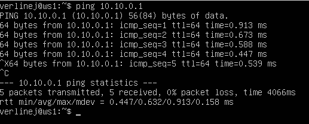

## Готовый дашборд
- Импортирую готовый дашборд Node Exporter Quickstart and Dashboard 

- Мониторинг после запуска скрипта из 2 части.

- Мониторинг после запуска утилиты stress

- Поднимаю ещё одну виртуальную машину, проверяю доступные сетевые интерейсы и проверяю соединение. 

- Запускаю утилиту iperf3

- Нагрузка сетевого итерфейса.
