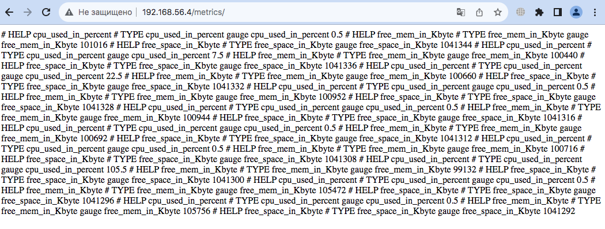
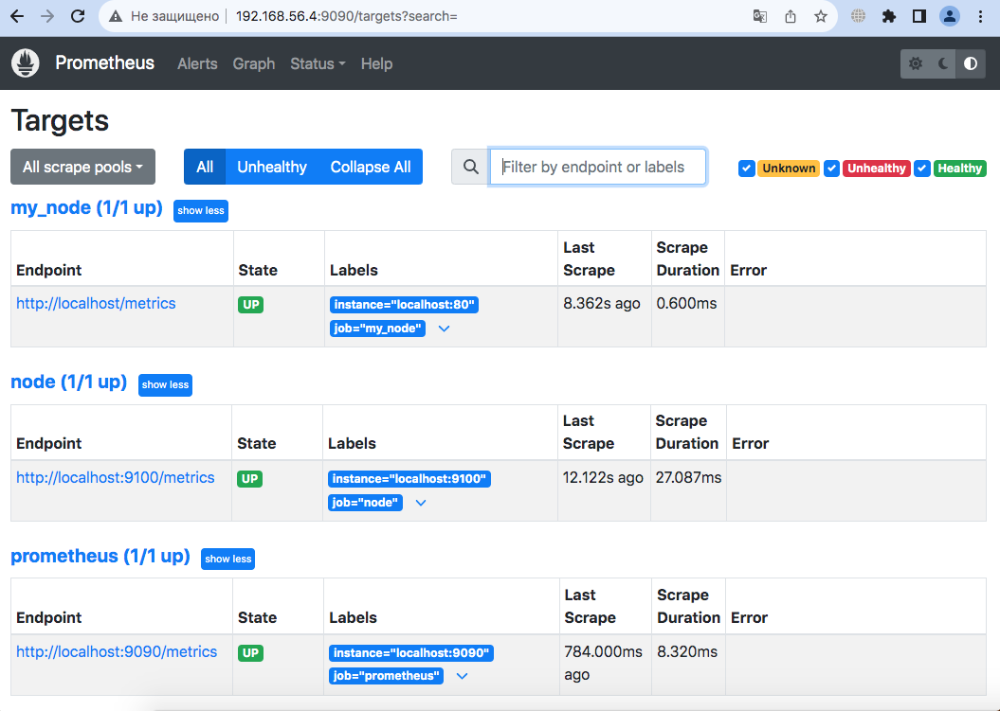
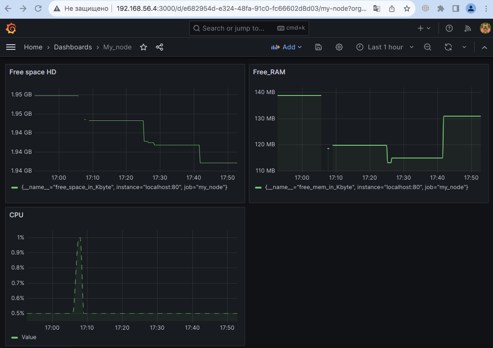
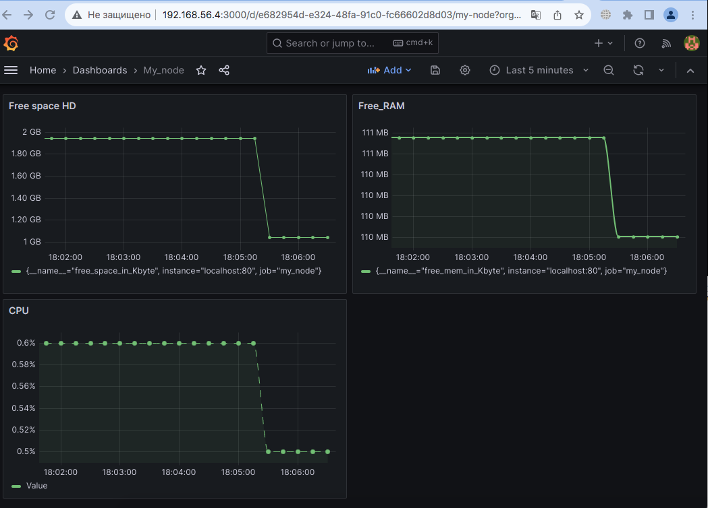
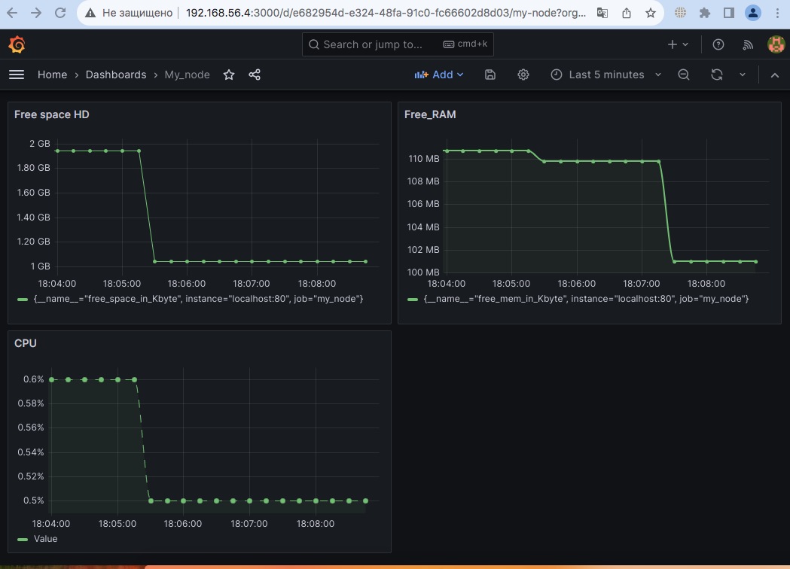

## Свой node_exporter

- После выполнения скрипта информация по моим метрикам доступна в localhost/metric 

- Внес изменения в конфиг файл Prometheus 

- Добавил дашборд по метрикам

- Запуск скрипта из 2 части

- Запуск iperf3 команды

