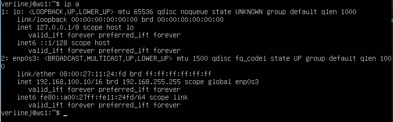
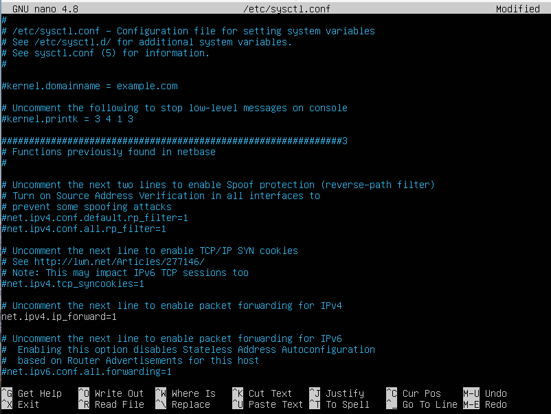

# Сети в Linux

## Part 1. Инструмент **ipcalc**

### Таблица масок


#### 1.1. Сети и маски
- Установим ipcalc `sudo apt install ipcalc`.


##### Определить и записать в отчёт:
##### 1) адрес сети *192.167.38.54/13*
 - ввожу команду `ipcalc  192.167.38.54/13`.
 

##### 2) перевод маски *255.255.255.0* в префиксную и двоичную запись, */15* в обычную и двоичную, *11111111.11111111.11111111.11110000* в обычную и префиксную

- ввожу `ipcalc 255.255.255.0`.
 
 - получается префиксная запись `/24`, двоичная `11111111.11111111.11111111. 00000000`

- ввожу `ipcalc 192.167.38.54/15`.

- получается обычная запись `255.255.0.0`, двоичная `11111111.11111111.00000000.00000000`.

- ввожу `ipcalc 192.167.38.54/28` (из таблицы).

 - получается обычная запись `255.255.255.240`, префиксная `/28`.


##### 3) минимальный и максимальный хост в сети *12.167.38.4* при масках: */8*, *11111111.11111111.00000000.00000000*, *255.255.254.0* и */4*

- командой `ipcalc 12.167.38.4/8`.

HostMin: 12.0.0.1.<br>
HostMax: 12.255.255.254.

- командой `ipcalc 12.167.38.4/16`.

HostMin: 12.167.0.1.<br>
HostMax: 12.167.255.254.

- командой `ipcalc 12.167.38.4/23`.

HostMin: 12.167.38.1.<br>
HostMax: 12.167.39.254.

- командой `ipcalc 12.167.38.4/4`.

HostMin: 0.0.0.1.<br>
HostMax: 15.255.255.254.


#### 1.2. localhost
##### Определить и записать в отчёт, можно ли обратиться к приложению, работающему на localhost, со следующими IP: *194.34.23.100*, *127.0.0.2*, *127.1.0.1*, *128.0.0.1*
- Диапозон IP адрессов localhost от 127.0.0.1 до 127.255.255.254.<br>
Соответственно подходящие из приведённых IP это: 127.0.0.2, 127.1.0.1.

#### 1.3. Диапазоны и сегменты сетей

##### 1) какие из перечисленных IP можно использовать в качестве публичного, а какие только в качестве частных: *10.0.0.45*, *134.43.0.2*, *192.168.4.2*, *172.20.250.4*, *172.0.2.1*, *192.172.0.1*, *172.68.0.2*, *172.16.255.255*, *10.10.10.10*, *192.169.168.1*
- Для кождого IP введём команду `ipcalc`.


- Нас интерисует строка **Host/Net** и фраза **Private Internet** .
- Значит IP 10.0.0.45, 192.168.4.2, 172.20.250.4, 172.16.255.255, 10.10.10.10 - можно использовать только в качестве частных;<br>
A IP 134.43.0.2, 172.0.2.1, 192.172.0.1, 72.68.0.2, 192.169.168.1 - можно использовать в качестве публичных.

##### 2) какие из перечисленных IP адресов шлюза возможны у сети *10.10.0.0/18*: *10.0.0.1*, *10.10.0.2*, *10.10.10.10*, *10.10.100.1*, *10.10.1.255*
- ввожу команду `ipcalc 10.10.0.0/18`.

- Данные адреса шлюза возможны у сети **10.10.0.0/18**: 10.10.0.2, 10.10.10.10, 10.10.1.255.

## Part 2. Статическая маршрутизация между двумя машинами

##### Поднять две виртуальные машины (далее -- ws1 и ws2)

##### С помощью команды `ip a` посмотреть существующие сетевые интерфейсы
- ws1


- ws2


##### Описать сетевой интерфейс, соответствующий внутренней сети, на обеих машинах и задать следующие адреса и маски: ws1 - *192.168.100.10*, маска */16*, ws2 - *172.24.116.8*, маска */12*

- Задаю статические адреса для обеих машиин.

- ws1


- ws2


##### Выполнить команду `netplan apply` для перезапуска сервиса сети
- ws1


- ws2


#### 2.1. Добавление статического маршрута вручную
##### Добавить статический маршрут от одной машины до другой и обратно при помощи команды вида `ip r add`
##### Пропинговать соединение между машинами
- Командой `sudo ip add 172.24.116.8 via 192.168.100.10 dev enp0s3` добавляю статический маршрут между машинами.

- Также и для второй машины `sudo ip add 192.168.100.10 via 172.24.116.8 dev enp0s3`.


- Пингую соединение.<br>
ws1
<br>
ws2


#### 2.2. Добавление статического маршрута с сохранением
##### Перезапустить машины
##### Добавить статический маршрут от одной машины до другой с помощью файла *etc/netplan/00-installer-config.yaml*
- делаю перезапуск машин `sudo reboot`, командой `ip r` проверяю добавленные в ручную статические маршруты удалились.
- ws1


- ws2


- Воношу изменения в файл конфигурации **00-installer-config.yaml** добавляя статический маршрут с сохранением.

- ws1


- ws2


##### Пропинговать соединение между машинами
- Пингую.

- ws1


- ws2


## Part 3. Утилита **iperf3**

#### 3.1. Скорость соединения
##### Перевести и записать в отчёт: 8 Mbps в MB/s, 100 MB/s в Kbps, 1 Gbps в Mbps

- 8 Mbps = 1 MB/s.
- 100 MB/s = 819200 Kbps.
- 1 Gbps = 1024 Mbps.

#### 3.2. Утилита **iperf3**
##### Измерить скорость соединения между ws1 и ws2
- Запускаю команду `iperf3 -s` на ws1, данная машина будет выступать в роли сервера.


- на ws2 ввожу `iperf3 -c 192.168.100.10`, машина выступает в роли клиента.


- Скорость соединеия между машинами<br>
sender - 3.88 Gbits/sec.<br>
reciver - 3.88 Gbits/sec.


## Part 4. Сетевой экран

#### 4.1. Утилита **iptables**
##### Создать файл */etc/firewall.sh*, имитирующий фаерволл, на ws1 и ws2:
```shell
#!/bin/sh

# Удаление всех правил в таблице "filter" (по-умолчанию).
iptables –F
iptables -X
```
##### Нужно добавить в файл подряд следующие правила:
##### 1) на ws1 применить стратегию когда в начале пишется запрещающее правило, а в конце пишется разрешающее правило (это касается пунктов 4 и 5)
##### 2) на ws2 применить стратегию когда в начале пишется разрешающее правило, а в конце пишется запрещающее правило (это касается пунктов 4 и 5)
##### 3) открыть на машинах доступ для порта 22 (ssh) и порта 80 (http)
##### 4) запретить *echo reply* (машина не должна "пинговаться”, т.е. должна быть блокировка на OUTPUT)
##### 5) разрешить *echo reply* (машина должна "пинговаться")

- создаю файл **firewall.sh** и вписваю команды с правилами.

- ws1.


- ws2.


##### Запустить файлы на обеих машинах командами `chmod +x /etc/firewall.sh` и `/etc/firewall.sh`

- Выдаю права и запускаю файл с командами и затем `iptables -L` что бы проверить применённые правила.

- ws1.


- ws2.


- Разнца между стратегиями в том, что утилита **iptables** выполняет первое прочитанное правило, значит на ws1 первым стоит запрет на пинг, на ws2 же наоборот превым правилом идёт разрешение.

#### 4.2. Утилита **nmap**
##### Командой **ping** найти машину, которая не "пингуется", после чего утилитой **nmap** показать, что хост машины запущен
*Проверка: в выводе nmap должно быть сказано: `Host is up`*


## Part 5. Статическая маршрутизация сети

##### Поднять пять виртуальных машин (3 рабочие станции (ws11, ws21, ws22) и 2 роутера (r1, r2))

- Поднимаю 5 виртуальных машин.


#### 5.1. Настройка адресов машин
##### Настроить конфигурации машин в *etc/netplan/00-installer-config.yaml* согласно сети на рисунке.

- Файл **etc/netplan/00-installer-config.yaml** для всех машин.

- ws11.


- ws21.


- ws22.


- r1.


- r2.


##### Перезапустить сервис сети. Если ошибок нет, то командой `ip -4 a` проверить, что адрес машины задан верно. Также пропинговать ws22 с ws21. Аналогично пропинговать r1 с ws11.

- Выполняю команду `netplan apply` и `ip -4 a`, для проверки того, что насторйки применены.

- ws11.


- ws21.


- ws22.


- r1.


- r2.


- Пингую ws22 c ws21.


- Пингую r1 с ws11.


#### 5.2. Включение переадресации IP-адресов.
##### Для включения переадресации IP, выполните команду на роутерах: `sysctl -w net.ipv4.ip_forward=1`
*При таком подходе переадресация не будет работать после перезагрузки системы.*

- r1.


- r2.


##### Откройте файл */etc/sysctl.conf* и добавьте в него следующую строку: `net.ipv4.ip_forward = 1`
*При использовании этого подхода, IP-переадресация включена на постоянной основе.*

- r1.


- r2.


#### 5.3. Установка маршрута по-умолчанию
##### Настроить маршрут по-умолчанию (шлюз) для рабочих станций. Для этого добавить `default` перед IP роутера в файле конфигураций

- Добавляю в файл, сторку gateway4(шлюз), который и булет ипользоваться по умаолчанию

- ws11.


- ws21.


- ws22.


##### Вызвать `ip r` и показать, что добавился маршрут в таблицу маршрутизации

- ws11.


- ws21.


- ws22.


##### Пропинговать с ws11 роутер r2 и показать на r2, что пинг доходит. Для этого использовать команду:
`tcpdump -tn -i eth1`

- Благодоря команде `tcpdump -tn -i enp0s8` на r2, вижу что пакеты доходят.

- ws11.


- r2.


#### 5.4. Добавление статических маршрутов
##### Добавить в роутеры r1 и r2 статические маршруты в файле конфигураций.

- r1.


- r2.


##### Вызвать `ip r` и показать таблицы с маршрутами на обоих роутерах. Пример таблицы на r1:
```
10.100.0.0/16 dev eth1 proto kernel scope link src 10.100.0.11
10.20.0.0/26 via 10.100.0.12 dev eth1
10.10.0.0/18 dev eth0 proto kernel scope link src 10.10.0.1
```

- r1.


- r2.


##### Запустить команды на ws11: `ip r list 10.10.0.0/[маска сети]` и `ip r list 0.0.0.0/0`

- Запускаю команды `ip r list 10.10.0.0/[маска сети]` и `ip r list 0.0.0.0/0`.


- Маршрут отличный от 0.0.0.0/0 был выбран из-за того, что он имеет более низкий приоритет, чем заданный вручную.

#### 5.5. Построение списка маршрутизаторов
##### Запустить на r1 команду дампа:
`tcpdump -tnv -i eth0`
##### При помощи утилиты **traceroute** построить список маршрутизаторов на пути от ws11 до ws21

- Выполнение команды `traceroute 10.20.0.10` для получения маршрута от ws11 до ws21.


- Выполнение команды `tcpdump -tnv -i enp0s8`.


> Принцип работы traceroute - для определения промежуточных маршрутизаторов traceroute отправляет целевому узлу серию ICMP-пакетов (по умолчанию 3 пакета), с каждым шагом увеличивая значение поля TTL («время жизни») на 1. Это поле обычно указывает максимальное количество маршрутизаторов, которое может быть пройдено пакетом. Первая серия пакетов отправляется с TTL, равным 1, и поэтому первый же маршрутизатор возвращает обратно ICMP-сообщение «time exceeded in transit», указывающее на невозможность доставки данных. Traceroute фиксирует адрес маршрутизатора, а также время между отправкой пакета и получением ответа (эти сведения выводятся на монитор компьютера). Затем traceroute повторяет отправку серии пакетов, но уже с TTL, равным 2, что заставляет первый маршрутизатор уменьшить TTL пакетов на единицу и направить их ко второму маршрутизатору. Второй маршрутизатор, получив пакеты с TTL=1, так же возвращает «time exceeded in transit». Процесс повторяется до тех пор, пока пакет не достигнет целевого узла. При получении ответа от этого узла процесс трассировки считается завершённым.


#### 5.6. Использование протокола **ICMP** при маршрутизации
##### Запустить на r1 перехват сетевого трафика, проходящего через eth0 с помощью команды: `tcpdump -n -i eth0 icmp`
##### Пропинговать с ws11 несуществующий IP (например, *10.30.0.111*) с помощью команды: `ping -c 1 10.30.0.111`

- Ввод команды `tcpdump -n -i enp0s8 icmp` на r1.


- Ввод команды `ping -c 3 10.30.0.111` на ws11.


## Part 6. Динамическая настройка IP с помощью **DHCP**2


##### Для r2 настроить в файле */etc/dhcp/dhcpd.conf* конфигурацию службы **DHCP**:
##### 1) указать адрес маршрутизатора по-умолчанию, DNS-сервер и адрес внутренней сети.

##### 2) в файле *resolv.conf* прописать `nameserver 8.8.8.8.`

- Для начала выполняю команду `sudo apt install isc-dchp-server` для установки сервера.

- Изменяю конфигурацию файла **dhcpd.config**.

И в файле **resolv.conf** прописываю `nameserver 8.8.8.8`.


##### Перезагрузить службу **DHCP** командой `systemctl restart isc-dhcp-server`. Машину ws21 перезагрузить при помощи `reboot` и через `ip a` показать, что она получила адрес. Также пропинговать ws22 с ws21.

- Перезагружаю службу **dchp**.


- На машине ws21 меняю настройки файла **00-installer-config.yaml**, для интерфейса enp0s8 меняю dhcp4 с false на true и убираю адресс заданный вручную.


- Применяю изменения `sudo netplan apply` и перезагружаю машину `sudo reboot`.

- Ввожу `ip a` и видно, что получен динамический ip 10.20.0.2/26.


- пингую ws22.


##### Указать MAC адрес у ws11, для этого в *etc/netplan/00-installer-config.yaml* надо добавить строки: `macaddress: 10:10:10:10:10:BA`, `dhcp4: true`

- Редактирую файл **00-installer-config.yaml**.


- В насторйках сети для ws11 в VirtualBox также добавляю macaddress.


##### Для r1 настроить аналогично r2, но сделать выдачу адресов с жесткой привязкой к MAC-адресу (ws11). Провести аналогичные тесты

- Также как и для r2 выполняю команду `sudo apt install isc-dchp-server` для установки сервера.

- Изменяю конфигурацию файла **dhcpd.config**.

И в файле **resolv.conf** прописываю `nameserver 8.8.8.8`.


- Пререзагружаю ws11 делаю комаду `ip a`, ip и macaddress применены.


- Пингую ws22.


##### Запросить с ws21 обновление ip адреса
- В отчёте поместить скрины ip до и после обновления.
- В отчёте описать, какими опциями **DHCP** сервера пользовались в данном пункте.

- IP на ws21 до запроса обновления

И после.

Для этого выполнил команды `sudo dhclient -r enp0s8` и `sudo dhclient enp0s8`, флаг -r для удаления старых ip.


## Part 7. **NAT**

##### В файле */etc/apache2/ports.conf* на ws22 и r1 изменить строку `Listen 80` на `Listen 0.0.0.0:80`, то есть сделать сервер Apache2 общедоступным

- Устанавливаю **apache2** `sudo apt install apache2`

- На ws22 и r1 меняю файл **ports.conf**<br>
ws22.

r1.

##### Запустить веб-сервер Apache командой `service apache2 start` на ws22 и r1
- Запускаю веб-сервис.

- ws22.<br>


- r1.<br>


##### Добавить в фаервол, созданный по аналогии с фаерволом из Части 4, на r2 следующие правила:
##### 1) удаление правил в таблице filter - `iptables -F`
##### 2) удаление правил в таблице "NAT" - `iptables -F -t nat`
##### 3) отбрасывать все маршрутизируемые пакеты - `iptables --policy FORWARD DROP`
##### Запускать файл также, как в Части 4
##### Проверить соединение между ws22 и r1 командой `ping`
*При запуске файла с этими правилами, ws22 не должна "пинговаться" с r1*

- Создаю на r2 файл firewall.sh и добавляю в него правила.


- Запускаю скрипт.


- Пингую r1 с ws22.

Как и должно быть пинг не проходит.

##### Добавить в файл ещё одно правило:
##### 4) разрешить маршрутизацию всех пакетов протокола **ICMP**
##### Запускать файл также, как в Части 4
##### Проверить соединение между ws22 и r1 командой `ping`
*При запуске файла с этими правилами, ws22 должна "пинговаться" с r1*

- Добавляю ещё правило и снова пингую.


Теперь всё работает.

##### Добавить в файл ещё два правила:
##### 5) включить **SNAT**, а именно маскирование всех локальных ip из локальной сети, находящейся за r2 (по обозначениям из Части 5 - сеть 10.20.0.0)
##### 6) включить **DNAT** на 8080 порт машины r2 и добавить к веб-серверу Apache, запущенному на ws22, доступ извне сети

- Добавляю правило для SNAT и для DNAT.

##### Запускать файл также, как в Части 4
##### Проверить соединение по TCP для **SNAT**, для этого с ws22 подключиться к серверу Apache на r1 командой:
`telnet [адрес] [порт]`
##### Проверить соединение по TCP для **DNAT**, для этого с r1 подключиться к серверу Apache на ws22 командой `telnet` (обращаться по адресу r2 и порту 8080)

- Проверяю соединение.<br>
ws22<br>
<br>
r1<br>


## Part 8. Дополнительно. Знакомство с **SSH Tunnels**

##### Запустить на r2 фаервол с правилами из Части 7

- Запускаю **firewall.sh** на r2.


##### Запустить веб-сервер **Apache** на ws22 только на localhost (то есть в файле */etc/apache2/ports.conf* изменить строку `Listen 80` на `Listen localhost:80`)

- Меняю **ports.conf**. и запускаю веб-сервер.


##### Воспользоваться *Local TCP forwarding* с ws21 до ws22, чтобы получить доступ к веб-серверу на ws22 с ws21

- На ws21 ввожу `ssh -L 8080:localhost:80 10.20.0.20`, что бы получить доступ к ws22.


##### Воспользоваться *Remote TCP forwarding* c ws11 до ws22, чтобы получить доступ к веб-серверу на ws22 с ws11

- На ws11 ввожу `ssh -R 8080:localhost:80 10.20.0.20`, что бы получить доступ к ws22.

##### Для проверки, сработало ли подключение в обоих предыдущих пунктах, перейдите во второй терминал (например, клавишами Alt + F2) и выполните команду: `telnet 127.0.0.1 [локальный порт]`

- запускаю `telnet 127.0.0.1 80`, для проверки соединения.
